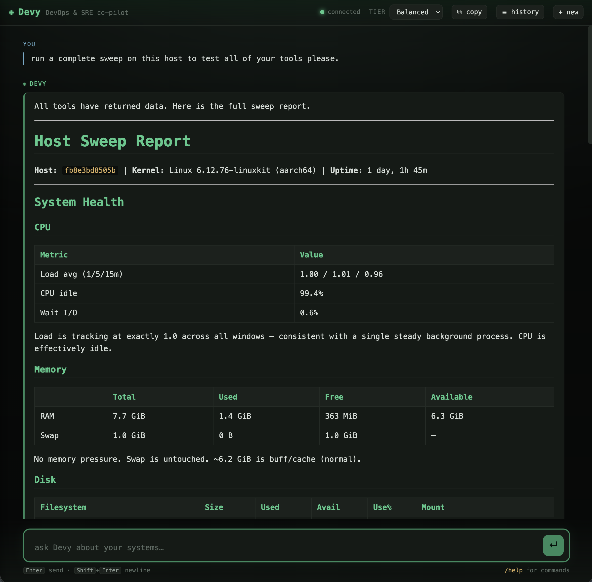
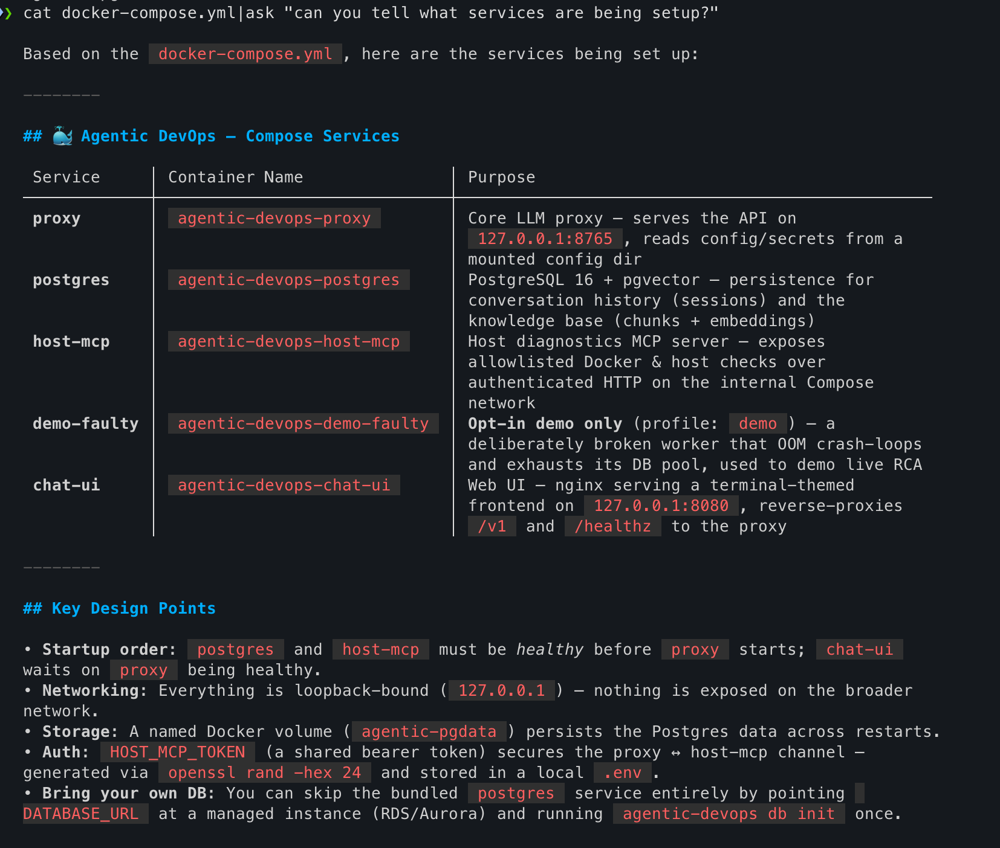
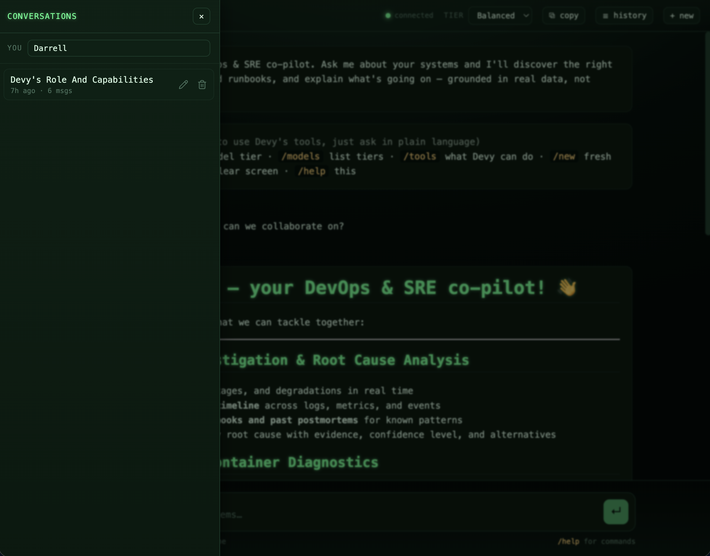
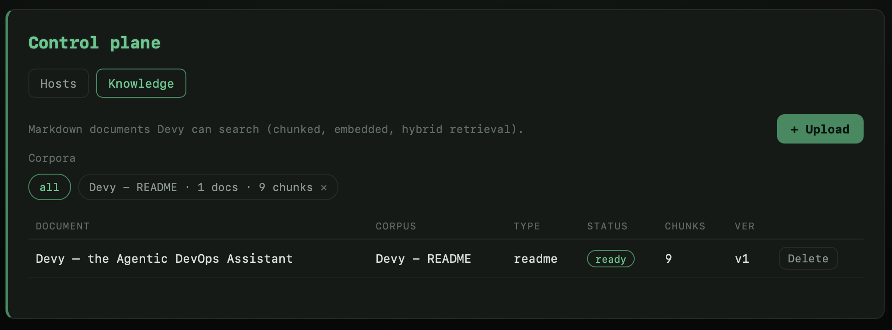

# Devy — the Agentic DevOps Assistant

[](https://opensource.org/licenses/Apache-2.0)
[](https://www.python.org/downloads/)
[](#status--roadmap)

**Devy** is an open-source, extensible **DevOps & SRE assistant** — one capable
agent behind a centralized service, with **pluggable components that act as
remote eyes and hands across your infrastructure and software layers**. You point
Devy at your systems (hosts, containers, runbooks, observability backends, and
your own in-house tools), and it helps you see what's happening, correlate
signals, and reason about where faults and issues are likeliest to live —
grounded in real data, not guesses.

<p align="center">
  
</p>

> *"Agentic DevOps" is the platform/service; **Devy** is the assistant you talk
> to.*

Devy is built to be **integrated, not just installed**. Every capability is a
component you can extend or replace: add a tool, mount an MCP server, point it at
a different model or embedder, plug in your observability stack, or build a new
front-end surface — all without touching the core. See
**[Extending Devy](docs/extending.md)**.

---

## How it works

One capable agent, exposed over one API, reachable from thin clients. The service
(the **LLM-PROXY**) owns all the reasoning, tools, memory, and tracing; every
surface is a dumb client of the same endpoints.

```
        surfaces (thin clients, no brain)
   ┌─────────┬───────────────┬────────────────┬────────────┐
   │ ask TUI │  web chat     │ history panel  │ one-shot   │
   │ (Go)    │  (web/)       │ (slide-out)    │ HTTP       │
   └────┬────┴──────┬────────┴───────┬────────┴─────┬──────┘
        │  HTTP + SSE (one API, every surface reuses it)
        ▼
┌──────────────────────────── LLM-PROXY (service) ───────────────────────────────┐
│  /v1/chat (stream)   /v1/complete (one-shot)   /v1/sessions   /v1/tools        │
│                                                                                │
│   Harness loop:  assemble context → model call → tool_use → execute → repeat   │
│      ├─ ProviderClient ... LiteLLM (OpenAI / Anthropic / Google / Ollama / …)  │
│      ├─ ToolsRouter ...... on-demand discovery: a single find_tools auto-load  │
│      ├─ Sessions ......... two-channel history + structured compaction         │
│      ├─ Knowledge ........ search_knowledge retrieval tool                     │
│      └─ Memory ........... recall_history (retrieval over past conversations)  │
└────────────────────────────────────────────────────────────────────────────────┘
        │  persistence                         │  pluggable tool sources
   Postgres + pgvector                  ┌──────┴───────────┬────────────────────┐
   (sessions + knowledge +              │ native tools     │ MCP servers        │
    conversation memory)                │ (diagnostics, …) │ host-MCP, your own │
                                        └──────────────────┴────────────────────┘
```

The defining design choices — **why** one agent instead of a committee, why one
brain behind thin surfaces, why discover tools on demand — are covered in
**[Architecture](docs/architecture.md)** (and the original journey from a much
more elaborate design is preserved as [background](docs/JOURNEY.md)).

## Extensible by design

Devy is a platform; these are its plug points. Each is documented in
**[Extending Devy](docs/extending.md)**.

| Extend… | How | Docs |
|---|---|---|
| **Tools** (eyes & hands) | Register a `ToolSpec`; the agent discovers it by intent via `find_tools` | [Tools & MCP](docs/extending.md#tools) |
| **Remote hosts** | Deploy the safe-allowlist **host MCP** (no shell, profile-gated) | [host-mcp/](host-mcp/README.md) |
| **Any in-house system** | Mount any **MCP server** (stdio or authenticated HTTP) | [Extending → MCP](docs/extending.md#mcp-servers) |
| **Observability** | Bring-your-own Grafana / CloudWatch / CloudTrail MCP | [Extending → Observability](docs/extending.md#observability) |
| **Models** | Map `fast`/`balanced`/`deep` tiers to any LiteLLM provider | [Configuration](docs/configuration.md#model-tiers) |
| **Knowledge** | Ingest your docs/runbooks; swap the embedder | [Knowledge](docs/knowledge.md) |
| **Storage** | Bundled Postgres or a managed instance (RDS/Aurora) | [Deployment](docs/deployment.md) |
| **Surfaces** | Build a new client against the HTTP/SSE API | [API reference](docs/api.md) |
| **Identity / auth** | Honor-system now; a JWT/SSO seam is in place | [Security](docs/security.md#identity) |

## Quickstart

The whole stack runs in Docker. You need a model provider key (or a local
Ollama). From a clean clone:

```bash
# 1. Configure model tiers — the operator decides which models back
#    fast / balanced / deep (any provider via LiteLLM, or local via Ollama).
mkdir -p ~/.config/agentic-devops
cp config.example.yaml ~/.config/agentic-devops/config.yaml   # then edit
cp .env.example        ~/.config/agentic-devops/.env          # add provider key(s)

# 2. A shared token for the host MCP (host + Docker diagnostics).
#    Note: this goes in the project-dir .env (compose's default env file),
#    separate from the config .env above.
echo "HOST_MCP_TOKEN=$(openssl rand -hex 24)" >> .env

# 3. Start the stack: postgres + proxy (:8765) + host-mcp + web chat (:8080)
docker compose up -d --build
#   The bundled Postgres (pgvector) self-bootstraps its schema on first start.
#   Managed DB instead? Set DATABASE_URL, run `agentic-devops db init` once,
#   and start only proxy/host-mcp/chat-ui. See docs/deployment.md.

# 4. Talk to Devy — in the browser…
open http://127.0.0.1:8080
#    …or build the native `ask` TUI (one static binary, zero runtime deps):
( cd tui && go build -o ask . ) && sudo mv tui/ask /usr/local/bin/
ask "is anything unhealthy on this box?"
df -h | ask "anything concerning here?"     # pipe context in
```

Users select a **tier** (`/model deep`), never a concrete model — the mapping is
an operator decision (cost, latency, security posture). Full setup, managed
databases, secrets, and the auth seam are in **[Deployment](docs/deployment.md)**;
every knob is in the **[Configuration reference](docs/configuration.md)**.

<p align="center">
  
  <br />
  <em>The native <a href="tui/README.md"><code>ask</code></a> TUI — pipe anything in
  (<code>cat docker-compose.yml | ask "what services are set up?"</code>) and get a rendered answer.</em>
</p>

## What Devy can do

- **Inspect live systems safely.** Host and Docker diagnostics (disk, memory,
  CPU, processes, sockets, systemd logs, container status/logs/stats) through the
  **[host MCP](host-mcp/README.md)** — a declarative, **profile-gated allow-list
  with no shell access**, which is what makes pointing it at a *production* host
  adoptable. → [Security](docs/security.md)
- **Ground answers in your docs.** Ingest runbooks, postmortems, and architecture
  docs; Devy retrieves and **cites** them via a `search_knowledge` tool. →
  [Knowledge](docs/knowledge.md)
- **Investigate incidents (RCA).** Root-cause analysis as adaptive detective work
  — survey reachable data, gather just enough, follow the evidence, build a
  correlated timeline, and converge on a ranked cause with citations. There's a
  **live crash-loop demo** ([below](#try-the-rca-demo)).
- **Remember across conversations.** Two-channel memory (a lossless transcript +
  a compact, token-triggered working summary) and a `recall_history` tool that
  pulls back specifics — within a chat or across prior ones. → [Memory](docs/memory.md)
- **Meet you where you work.** A terminal-themed [web chat](web/README.md) with a
  conversation-history slide-out, a native Go [`ask` TUI](tui/README.md), and a
  one-shot HTTP endpoint for scripting. → [API](docs/api.md)

<p align="center">
  
  <br />
  <em>Conversation history — auto-titled chats per user, with recall, rename/delete,
  and copy-as-Markdown. → <a href="docs/memory.md">Memory</a></em>
</p>

<p align="center">
  
  <br />
  <em>Feeding the knowledge base — the admin <strong>Knowledge</strong> page imports
  Markdown into a corpus (chunked, embedded, hybrid-indexed) so Devy can cite it.
  → <a href="docs/api.md">Admin API</a></em>
</p>

### Try the RCA demo

```bash
agentic-devops ingest corpora/platform              # the matching runbook
docker compose --profile demo up -d demo-faulty     # a container that crash-loops
```

Then ask Devy: *"The `agentic-devops-demo-faulty` container keeps cycling —
investigate it and tell me the likely root cause, with evidence and a fix."* It
pulls live container logs/status (host MCP), cross-references the runbook and past
postmortems (knowledge base), builds a `correlate_timeline` chronology, and
produces a ranked RCA — distinguishing the OOM *symptom* from the pool-exhaustion
*root cause*. Stop it with `docker compose --profile demo down`.

## Documentation

| Doc | What's in it |
|---|---|
| **[Architecture](docs/architecture.md)** | The design — proxy, harness loop, tools-router, memory model, request flow |
| **[Extending Devy](docs/extending.md)** | Every plug point: tools, MCP, observability, models, embedders, storage, surfaces, auth |
| **[Configuration](docs/configuration.md)** | Full `config.yaml` + `.env` + environment-variable reference |
| **[Deployment](docs/deployment.md)** | Compose stack, managed Postgres/RDS, native, secrets, scaling, the auth seam |
| **[Security](docs/security.md)** | The host-MCP boundary, data handling & privacy, prompt-injection posture |
| **[API reference](docs/api.md)** | HTTP/SSE endpoints (and the live OpenAPI docs) |
| **[Proxy](docs/proxy.md)** · **[Knowledge](docs/knowledge.md)** · **[Memory](docs/memory.md)** | Subsystem deep-dives |
| **[host MCP](host-mcp/README.md)** · **[web chat](web/README.md)** · **[`ask` TUI](tui/README.md)** · **[corpora](corpora/README.md)** | Component docs |
| **[Contributing](CONTRIBUTING.md)** · **[Security policy](SECURITY.md)** | For contributors |
| **[Background / journey](docs/JOURNEY.md)** | How the design got here (optional reading) |

## Status & roadmap

**Implemented and tested** (Postgres-backed, live-verified end-to-end):

- The containerized **LLM-PROXY** + agent harness + on-demand **tools-router**.
- **Tiered, provider-agnostic** models (LiteLLM); users pick a tier, not a model.
- **MCP**: mount any MCP server, plus the deployable **safe-allowlist host MCP**
  (host + Docker diagnostics, no shell, profile-gated, bearer auth).
- **Knowledge base**: enriched ingest (deterministic structural context, optional
  LLM synopsis) → **hybrid** `search_knowledge` (vector + full-text, RRF-fused)
  with metadata-rich citations.
- **Incident RCA** as an adaptive mode of reasoning + a `correlate_timeline` helper.
- **Surfaces**: web chat (with history slide-out), native `ask` TUI, one-shot HTTP.
- **Persistence**: Postgres + pgvector (bundled or managed/RDS), self-bootstrapping.
- **Conversation memory**: two-channel history + token-triggered structured
  compaction, and `recall_history` for cross-conversation recall.
- **Admin control plane** (`/v1/admin/*` + admin UI, behind an interim password):
  a DB-backed **host registry** (the fleet Devy reaches via host MCP, with
  per-host tokens encrypted at rest) and **document import** (UI upload → async,
  enriched ingestion into the hybrid knowledge base).

**Next** — a dependency-ordered chain from *foundation* → *expanded reach* → *the
leap from observing to acting*. Full breakdown (with the "why it builds on the last"
for each): **[Roadmap](docs/plans/roadmap.md)**.

1. **Identity & access** — real **SSO** (Google / Cloudflare+Okta JWT) replacing the
   interim admin password, plus **RBAC** (who may admin / use `elevated` / see which
   corpora). The auth verifier and identity seams are already in place.
2. **Observability & evaluation** — **LangSmith** waterfall tracing of harness/LLM
   calls, and a golden-set eval + feedback harness as a quality gate.
3. **Extended retrieval** — new `find_tools` backends fused into hybrid search: file,
   structured/JSONB, web (Tavily/Brave), optional graph; plus scheduled re-ingest.
4. **Reach** — hardened **bring-your-own MCP**, and observability adapters: **Grafana**,
   **AWS CloudWatch / CloudTrail**, AWS auto-discovery into the host registry.
5. **DB-broker MCP** — a fixed, allow-listed query plane (the read-side twin of the
   host MCP) — never raw database access.
6. **Hosting hardening** — secrets backend (Vault / AWS Secrets Manager), cost/rate
   budgets, PII/secret redaction, and a unified, exportable audit trail.
7. **Guarded actions** — a safe write path: Devy *proposes* a remediation, a human
   *approves* it in the UI (gated by profile + RBAC, fully audited).
8. **Proactive & ChatOps** — alert-webhook-triggered auto-RCA and a Slack/Teams
   surface, so Devy lives in the incident channel and reacts on its own.

## License & attribution

Licensed under the **Apache License 2.0** — see [LICENSE](LICENSE) and
[NOTICE](NOTICE). You're free to use, modify, and build on this, including
commercially; please retain the attribution in `NOTICE`.

Built and maintained by **Darrell Westbury**. Commercial implementation and
consulting — help standing Devy up against your own infrastructure — are
available from the author.

## Contributing

Contributions are welcome — see **[CONTRIBUTING.md](CONTRIBUTING.md)** for dev
setup, tests, and conventions, and **[SECURITY.md](SECURITY.md)** to report a
vulnerability. For substantial changes, please open an issue to discuss first.
